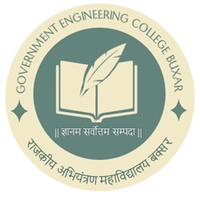

<p align="center">
  
</p>

<h1 align="center">NAVRANG ’26</h1>

<p align="center">
  <strong>Dandiya Night 2026</strong>
</p>

<p align="center">
  An enchanting evening of Garba, culture, music, and togetherness — celebrating the spirit of Navratri with the GEC Buxar campus.
</p>

<p align="center">
  <a href="https://navrangutsav.vercel.app/">Live Website</a>
  ·
  <a href="https://github.com/amankumarhappy/NAVRANG_UTSAV">Repository</a>
</p>

<p align="center">
  
  
  
  
  
</p>

---

## 🎉 About NAVRANG ’26

**NAVRANG ’26 — Dandiya Night 2026** is a campus celebration organised for the students of **Government Engineering College, Buxar**.

The event brings together Garba, traditional dance, music, cultural performances, and the wider GEC Buxar community for an evening dedicated to the spirit of Navratri.

### Event Details

| Detail | Information |
|---|---|
| **Event** | NAVRANG ’26 — Dandiya Night 2026 |
| **Date** | 14 October 2026 |
| **Time** | 3:00 PM – 8:00 PM Onwards |
| **Venue** | GEC Buxar Campus |
| **Registration Fee** | ₹200 per student / head |
| **Eligibility** | B.Tech batches 2023, 2024, 2025 and 2026 |
| **Organised By** | 2024 Batch |
| **Dress Code** | Traditional attire for Boys and Girls |

---

## ✨ Event Highlights

- 🎊 Grand Inauguration Ceremony
- 🪔 Durga Vandana & Special Cultural Presentation
- 💃 Solo Dance Performances
- 🕺 Group Garba Formations
- 🎵 Festive Music & Open Garba
- 🌸 Campus Celebration
- 💧 Drinking Water & Essential Student Amenities
- 🩹 First-Aid / Help-Desk Assistance

The detailed programme and performance timings are announced separately by the organising team.

---

## 🎟️ Registration Flow

NAVRANG ’26 uses a digital registration and verification workflow.

```text
Student
   │
   ▼
Registration Form
   │
   ├── Student Details
   ├── Batch / Branch
   ├── Payment UTR
   └── Payment Screenshot
   │
   ▼
Firebase Realtime Database
   │
   ▼
Registration ID Generated
   │
   ▼
PENDING
   │
   ▼
Admin Verification
   │
   ├── Review Details
   ├── Preview Payment Screenshot
   └── Verify UTR / Payment
   │
   ▼
APPROVED
   │
   ▼
Digital Pass + QR Code
   │
   ▼
Event Check-in
